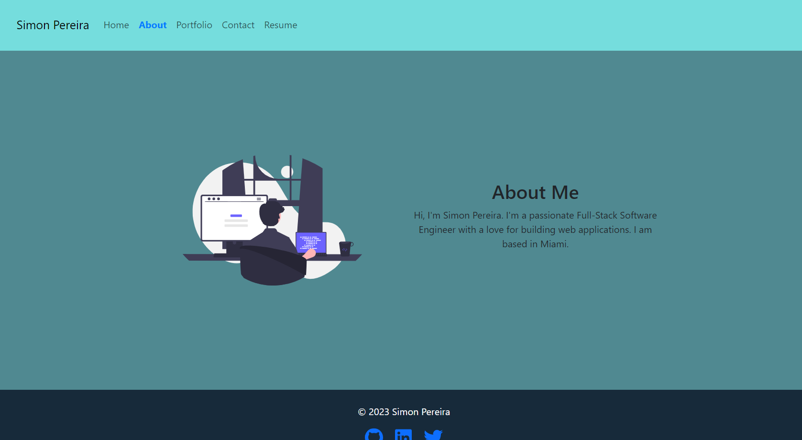
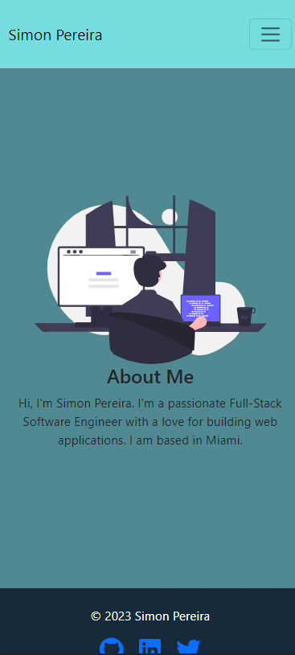

# React Portfolio Challenge

## License

This project is licensed under the [MIT License](https://opensource.org/licenses/MIT).

## Description

Single-page React Portfolio featuring information about me, my resume, my projects and the technologies I know.

## Table of Contents

- [Live](#live)
- [Screenshots](#screenshots)
- [Questions](#questions)

## Live

You can visit the live application here: https://spereira15.github.io/react-portfolio-challenge/.

## Screenshots

On wide screens:

On smaller screens:

## Questions

If you have any questions or need further assistance, feel free to reach out:

- GitHub: [spereira15](https://github.com/spereira15)
- Email: simonpereira15@hotmail.com